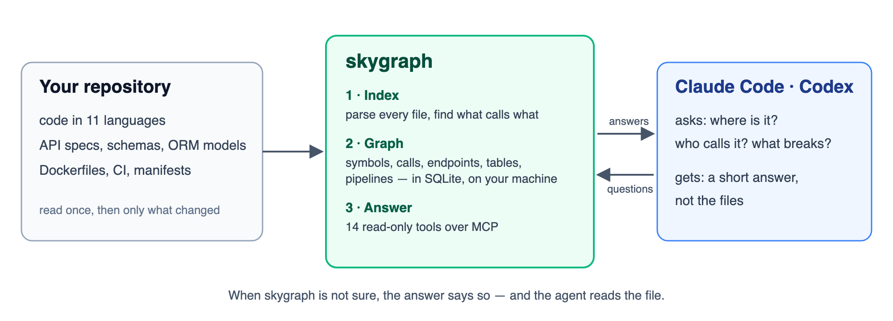
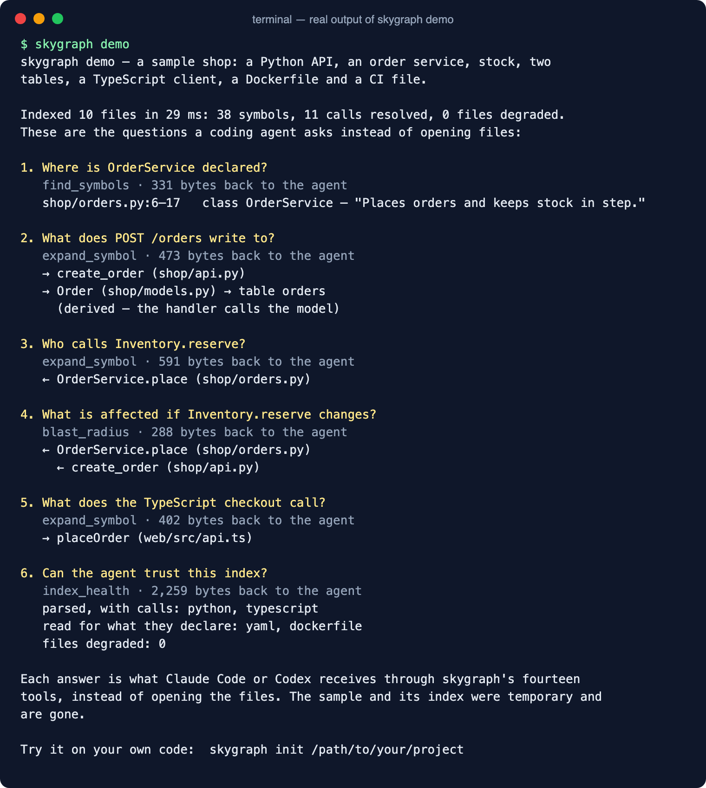

# Skygraph

[](https://github.com/arupmmi07/skygraph/actions/workflows/tests.yml)
[](https://www.python.org/downloads/)
[](LICENSE)

*A map of your code, for the coding agent reading it.*

Skygraph reads a code repository once and gives Claude Code, Codex or any other AI coding
assistant a map of it: where each function and class is, what calls what, which endpoint
writes which table, and what a change would affect. The assistant asks the map instead
of opening files, so less of its context window — the limited amount of text it can hold
at once — goes on finding its way around. Your code stays on your machine unless you
turn on the optional model tier.



## The problem

A coding agent starts every session knowing nothing about your repository. It lists
folders, opens likely files and guesses, and pays for that in time and context every
session. A text search finds names, not meaning: it cannot tell which of twenty `save`
methods a call means, or which table an endpoint writes. Skygraph does the reading once,
keeps it current, and answers those questions directly — and says so when it is not sure.

## Words you need

- **Index** — what skygraph builds: every symbol, call, import, endpoint, table and
  pipeline in the repository, in one SQLite file in `~/.skygraph`.
- **MCP** — the Model Context Protocol, the standard way Claude Code and Codex call
  outside tools. Skygraph is an MCP server with fourteen read-only tools.
- **Resolved** — a call is resolved when skygraph knows which declaration it means. When
  it cannot tell, it says `untyped` or `ambiguous` instead of guessing.

## See it work in sixty seconds

You need Python 3.11 or newer and git. No account, no key, no project of your own:

```bash
pipx install "git+https://github.com/arupmmi07/skygraph.git@v0.2.0"
skygraph demo
```

The demo indexes a small sample shop and asks it what a coding agent would ask. This is
its real output:



## Use it in three steps

1. **Install it**, as above. `pip install` into a virtual environment works too.
2. **Wire your project.** This writes the server settings for Claude Code, a paragraph in
   `CLAUDE.md` telling the agent to ask the map first, and a hook that refreshes the index
   when a session starts; then it indexes once.

   ```bash
   skygraph init /path/to/your/project
   ```

3. **Restart Claude Code in that project** and ask, for example: *"Use skygraph: who calls
   `refund`, and what breaks if I change it?"* For Codex, add `--codex` to step 2.

## What happens on every run


Skygraph walks the repository and skips every file whose content has not changed since
the last run. It parses each changed file and reads endpoints, tables, pipelines and
settings from code and config. Then it works out which declaration each call means and
joins the layers, so an endpoint leads to its handler and its table — see
[how it works](docs/architecture.md).

## What you get

- Fourteen read-only tools: find a symbol, outline a file, see what calls it and what it
  calls, trace an endpoint to its table, walk the effect of a change, check the index.
- Eleven languages parsed, not pattern-matched: Python, TypeScript, JavaScript, Java,
  Go, Rust, C#, Kotlin, Swift, PHP and Ruby.
- API specs, database schemas and deployment files: OpenAPI, FastAPI, Flask, Express,
  Spring, SQL, Prisma, SQLAlchemy, Django, JPA, Dockerfiles, Compose, Kubernetes, GitHub
  Actions and GitLab CI.
- Honest answers: every unresolved call says why, and `index_health` shows what was
  parsed and what was guessed.
- One-command setup for Claude Code and Codex, with a refresh at every session start.

## What it is not

It is not a search engine or a vector database: it answers questions about structure,
not "find code like this". It never edits your code and has no write tool. Call
resolution is partial — between 24 % and 74 % of calls, by language — and every other call
is marked, so the agent knows when to read the file.

## Status

Version 0.2.0, beta. 279 tests on Python 3.11 to 3.14, including a benchmark of agent
questions with hand-checked answers. Next on the [roadmap](ROADMAP.md): refreshing the
index after every edit and every git checkout. Contributions are welcome.

## Read more

| | |
|---|---|
| [Getting started](docs/getting-started.md) | Install options, commands, troubleshooting, privacy, uninstall |
| [Reference](docs/reference.md) | The fourteen tools, languages and frameworks, what answers mean, limits |
| [How it works](docs/architecture.md) | The pipeline, the resolver, and why each rule exists |
| [Connecting it by hand](docs/connecting.md) | Other MCP hosts, running from a checkout, the optional model tier |
| [Roadmap](ROADMAP.md) · [Contributing](CONTRIBUTING.md) | What is planned, and how to pick a feature |
| [Changelog](CHANGELOG.md) · [Security](SECURITY.md) | What changed, and how to report a problem |

## Licence

[Apache 2.0](LICENSE).
