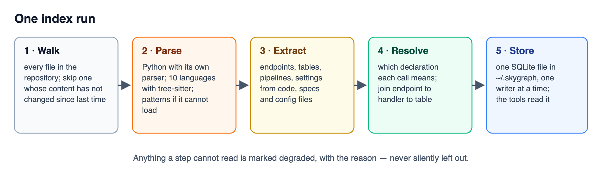

# Architecture

```
  file ──► router ──► front end ──► FileResult ──► writer ──► SQLite ──► MCP
            │          tier 1/2/3    symbols       schema      scoped     read-only
            │                        edges         check       rows       tools
            └── picks the highest tier that claims the extension
```




## Stages

**Intake.** One file, whole. An AST needs the complete file, not a window — so files
are not chunked before parsing.

**Router.** `frontends.language_of()` maps the extension to a language, and `parse()`
routes to the highest tier that claims it. Unknown extensions go to tier 3.

**Front end.** Emits `Symbol` and `Edge` objects from the shared vocabulary. Nothing
else. A front end cannot invent a node kind — `schema.py` raises if it tries.

**Writer.** Attaches repo and branch to every row and writes. The scope is not optional
and is not a query-time concern.

**Store.** SQLite. Three tables — `symbols`, `edges`, `files` — each carrying `repo` and
`branch`, with indexes on the scoped lookups.

**MCP.** Fourteen read-only tools over stdio JSON-RPC.

## Resolving calls

Calls are resolved by scope, then by name. On the Python service above, `get` is
declared 57 times, so a name alone decides nothing. The resolver works narrowest first:

| Call | Found by |
|---|---|
| `self.x()` inside a class | that class, then another class in the same file |
| `svc.find()` on a field, parameter or local with a declared type, or built by a constructor or a typed factory | that type, in every language that declares types |
| a name imported through a barrel (`index.ts`, `__init__.py`) | the file that actually declares it |
| a call on an interface or base class | the interface; `expand_symbol` on an implementation lists those callers too, marked `via` |
| `module.x()` on an imported module or Go package | that module |
| a bare `x()` | `this` in a Java-family class that declares it, then the same file, an import, then the one declaration of that name in the language |
| `receiver.x()` on anything else | **nothing — left `untyped`** |

An unknown receiver is never resolved on the name being unique: `config.get("a")` is a
dictionary, not a call to the one class that happens to declare `get`.

**The parsers are what give calls.** The same 10,089-file monorepo, indexed both ways
on a laptop:

| | patterns only | with parsers |
|---|---|---|
| symbols | 16,166 | **38,790** |
| edges | 41,628 | **284,832** |
| resolved calls | 14 | **38,909** |
| cold index | 14 s | 27 s |

## Naming

A node is `<path>` for a module, or `<path>::<symbol>` for anything inside it. Nested
symbols use dots: `app/svc.py::Alpha.run`.

Splitting on the first `::` gives the file a symbol lives in, which is what makes
one-hop expansion useful: the neighbour's file is recoverable from its name alone,
without a second lookup.

## Degradation

Every file row carries a `degraded` column. It is `NULL` when the file parsed at its
best tier, and a sentence when it did not:

```
python AST failed (invalid syntax line 12); fell to heuristic
no front end for zig; names found by pattern, not by parsing
```

`skygraph degraded --repo X` lists them. Read it after a first index — that list is
the honest measure of coverage, and it is the number to quote rather than the file
count.

## What tier 2 cannot do

Tier 2 is line patterns — the floor when a parser cannot load — and a line pattern can
see a declaration but not a call. So **no tier-2 language produces `CALLS` edges at
all**: TypeScript, Java, Go and the rest
yield a list of classes and functions, and nothing to traverse. On a large TypeScript
repository that means `blast_radius`, `related_symbols` and `expand_symbol.called_by`
come back empty, correctly and unhelpfully.

`index_health` reports this per language rather than leaving an agent to infer it from
silence, because a thin graph and a complete one answer the same way — one just answers
less:

```
                  patterns only                  with the parsers
typescript   files 8551  symbols 10672  calls 0   symbols 26236  calls 108276
java         files 892   symbols 4102   calls 0   symbols 11125  calls 80354
```

(A 10,089-file Angular and Java monorepo, indexed both ways.)

The parsers fix it, and `pip install skygraph` brings them: tree-sitter becomes tier 1
for every language that is not Python, behind the same `Symbol` and `Edge` boundary, so nothing
downstream changes. See **The parser tier** below.

## Also not built

- **Cross-repository resolution.** An import naming a symbol in another indexed
  repository is stored as a name, not resolved to that repository's node.

## The ontology passes

`code_ontology` reads what the language declares. The other extractors read what a
*framework* declares on top of it, which is usually the thing a question is about.
Nobody asks which class inherits `Base`; they ask which table the orders endpoint
writes to.

A file is therefore read twice over — once for its structure, once for its ontologies —
and the second pass appends. Its rows are still replaced as one unit.

| Ontology | Source | Tier | Why that tier |
|---|---|---|---|
| data_ontology | `__tablename__`, `CREATE TABLE`, Prisma `model` | native | a declaration |
| data_ontology | a base class named `Base`, `Model`, `SQLModel` | query | a naming convention |
| api_ontology | OpenAPI in JSON | native | parsed with `json` |
| api_ontology | OpenAPI in YAML | query | a small reader, not a YAML parser |
| api_ontology | FastAPI and Flask decorators | native | read off the syntax tree |
| api_ontology | Express and Spring routes | query | matched by pattern |

### The reader is a scan, not a regular expression

The key/value split used to be `((?:"[^"]*"|'[^']*'|[^:])+?):`. A quoted run can match
either the quoted branch or one `[^:]` at a time, so a line with many quoted segments
has exponentially many readings and the engine tries all of them. One GitLab CI line
with forty `_VAR="$VAR"` pairs stopped a 22,000-file index for over an hour, on a 2 KB
file.

The first test written for it used a long line of `aaaa…` and passed instantly, because
without quotes there is no ambiguity and nothing to backtrack. **The shape mattered, not
the length** — which is why the regression test uses the real shape.

A scan is linear and has nothing to backtrack, so that is what it is now.

### Why there is no YAML dependency

There is no YAML parser in the standard library, and the parsers are skygraph's one
dependency. `miniyaml.py` reads the YAML that configuration files are actually written
in — mappings, lists, flow collections, block scalars, anchors, aliases, merge keys, and
tags (dropped, value kept). On 141 real CI, Kubernetes, Compose, Helm-values and
ontology files it returns exactly what PyYAML returns, apart from PyYAML's YAML 1.1
habit of reading the key `on:` as `True`. What it does not implement — complex keys,
directives, a flow collection spanning lines, and Helm templates, which are not YAML
until rendered — it refuses, and the file is marked degraded with the reason rather than
indexed as an empty, healthy file.

## The link pass

Runs after every file is in, and after calls are resolved, because the middle step of
the chain *is* a call.

```
Endpoint ──HANDLED_BY──► Function ──PERSISTS_TO──► Entity ──MAPS_TO──► table
 native                   query                     native
```

`HANDLED_BY` and `MAPS_TO` are read from declarations. `PERSISTS_TO` is derived from a
resolved call whose target is also an entity: constructing or querying a model is how
ORM code touches a table, so a function calling `User(...)` almost certainly writes to
`users`.

*Almost certainly* is the honest phrase, which is why the edge is tier `query` and the
trace says so. The failure this avoids is not being wrong — it is being wrong in a way
that looks identical to being right.

`PERSISTS_TO` is rebuilt from scratch on every index, because a derived edge whose
inputs have changed is worse than no edge.

## The deploy pass

| Source | Read as | Tier |
|---|---|---|
| `Dockerfile`, `Dockerfile.*`, `*.Dockerfile` | every `FROM ... AS` stage is an Image; `ENV` and `ARG` are EnvVars | native |
| `docker-compose.yml` | each service is a Deployable that `RUNS` an Image | query |
| Kubernetes manifests | `Deployment`, `StatefulSet`, `CronJob`… are Deployables | query |
| GitHub Actions, GitLab CI | a Pipeline with Stages | query |

Three judgements worth recording, because each one had an obvious wrong answer:

**A ConfigMap is not a Deployable.** Neither is a Service. They configure and they
route; neither has a process in it, and calling them deployables makes *what runs this*
return objects that do not run.

**`EXPOSE` describes an image, it does not declare a second thing to deploy.** It used
to produce a Deployable, which produced a row saying the image ran itself — true,
useless, and in the way of every real answer. It is now part of the image's summary.

**Only a job that deploys is marked as deploying.** A job that merely *mentions*
deploying is usually the one building the artefact that gets deployed later, so the
match is on the job's name rather than on its whole script.

## The environment join

The most useful edge in the graph, and the cheapest to get wrong.

A file that reads `os.environ["DATABASE_URL"]` cannot know who sets it, and a compose
file that sets it cannot know who reads it. So a read is recorded against the file as a
bare name, and the link pass points it at the declaration once every manifest is in:

```
DATABASE_URL   read by settings.py   declared in Dockerfile, docker-compose.yml
SECRET_KEY     read by settings.py   declared in (nowhere)
```

A read is **not** a declaration and never becomes an `EnvVar` symbol. That distinction
is what makes the second line meaningful: a variable read but never declared here is
set by the platform, a secret store, or nobody at all.

## The model tier

It runs as a second pass in the indexer, not inside `parse()`. Three reasons, and the
first is the one that decided it:

- The budget is a property of a run, not of a file. One place to cap it.
- `parse()` stays pure and fast: no network call, no key, nothing to stub in a test
  that is not about the model.
- It can only be offered files that are already written, so a failure costs a better
  answer rather than the file.

```
walk ─► parse (tiers 1–2, or the heuristic floor) ─► write
                                                      │
                             files nothing claimed ───┘
                                      │
                                      ▼
                              model pass, if a key exists
                                      │
                              replace those files' rows
```

### It could not fire at all, for a long time

The walk skipped every file no front end claimed. So a language with no tier-2 pattern
was not read badly — it was not read at all, and neither a model nor the heuristic floor
ever saw one. `unclaimed_source` is the rule that fixed it, and it is deliberately
narrow: the file must have an extension, that extension must not be a document, archive
or image, and no front end may already claim it.

That is worth remembering as a shape. The tier existed, the code was written, the tests
passed, and nothing reached it — a gap that a test of the tier itself would not have
found, because the tier worked.

### What holds it honest

**The ontology is the authority for a model exactly as for a parser.** An undeclared
kind has its row dropped and counted. An edge whose source the same reply did not
declare is a model describing code it was not shown, and goes the same way.

**Its rows are never mixed in.** Tier `model` means `Symbol.parsed` is false, and
`index_health` reports `parsed_symbols` against `inferred_symbols`. A graph that mixed a
read fact with a model's reading of a file it could not parse, indistinguishably, would
be worse than one simply missing the file — the gap is at least visible.

**A second run asks nothing.** The content hash decides what is re-read, so the most
expensive tier is paid for once per version of a file.

## What is not built

Nothing declared is now unimplemented. The remaining limits are named in the README:
call resolution is thinnest in Rust, Ruby and around Swift overloads, where "who calls
this" is a lead rather than a list, and `PERSISTS_TO` is a derived lead rather than a
fact.

## The parser tier

One module, `treesitter.py`, and one query file per language under `skygraph/queries/`
— the only place a grammar's vocabulary appears. Everything downstream sees the same `Symbol` and `Edge`
it always did.

Three decisions worth recording:

**The receiver is kept, exactly as in Python.** `this.format()` becomes `self.format`
and `sys.stdout.write()` stays whole, so one set of resolution rules covers every
language and a method on an unknown object is never guessed at — in any of them.

**A name is never matched across a language.** Found in a sample of ten on a real
repository: a Java test calling `put()` had resolved to a TypeScript `ApiClient.put`,
because the name was declared exactly once, in another language. About 4,400 edges were
wrong the same way. Candidates are now filtered by the caller's language first.

**A file tree-sitter chokes on falls to the pattern tier and says so**, rather than
taking the index down with it.

Arrow functions bound to a name — `const build = () => {...}` — are declarations too,
which matters because modern TypeScript writes most of its code that way and a
`function` pattern sees none of it.

## Diagram sources

The pictures are hand-written SVG in `docs/images/`, each with the PNG rendered from it
beside it (`python3 ../check-docs.py --render <svg>` from the project folder): `run.svg`
here, `overview.svg` and `demo.svg` in the README, `index-refresh.svg` in
[Keeping the index fresh](design/index-refresh.md). `demo.svg` is generated from the real
output of `skygraph demo`. There is no Mermaid source.
