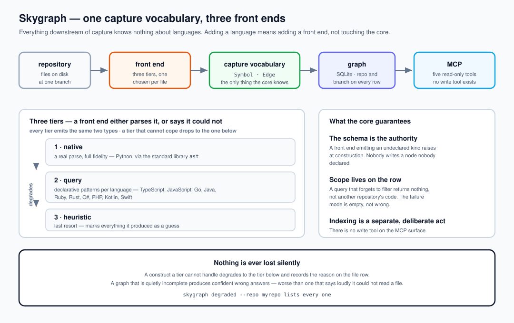

# Architecture

```
  file ──► router ──► front end ──► FileResult ──► writer ──► SQLite ──► MCP
            │          tier 1/2/3    symbols       schema      scoped     read-only
            │                        edges         check       rows       tools
            └── picks the highest tier that claims the extension
```




## Stages

**Intake.** One file, whole. An AST needs the complete file, not a window — so files
are not chunked before parsing.

**Router.** `frontends.language_of()` maps the extension to a language, and `parse()`
routes to the highest tier that claims it. Unknown extensions go to tier 3.

**Front end.** Emits `Symbol` and `Edge` objects from the shared vocabulary. Nothing
else. A front end cannot invent a node kind — `schema.py` raises if it tries.

**Writer.** Attaches repo and branch to every row and writes. The scope is not optional
and is not a query-time concern.

**Store.** SQLite. Three tables — `symbols`, `edges`, `files` — each carrying `repo` and
`branch`, with indexes on the scoped lookups.

**MCP.** Five read-only tools over stdio JSON-RPC.

## Naming

A node is `<path>` for a module, or `<path>::<symbol>` for anything inside it. Nested
symbols use dots: `app/svc.py::Alpha.run`.

Splitting on the first `::` gives the file a symbol lives in, which is what makes
one-hop expansion useful: the neighbour's file is recoverable from its name alone,
without a second lookup.

## Degradation

Every file row carries a `degraded` column. It is `NULL` when the file parsed at its
best tier, and a sentence when it did not:

```
python AST failed (invalid syntax line 12); fell to heuristic
no front end for zig; names found by pattern, not by parsing
```

`skygraph degraded --repo X` lists them. Read it after a first index — that list is
the honest measure of coverage, and it is the number to quote rather than the file
count.

## What is not built

- **End-of-range line numbers.** Declarations carry a start line; the walkers do not
  persist an end line yet.
- **Cross-repository resolution.** An import naming a symbol in another indexed
  repository is stored as a name, not resolved to that repository's node.
- **Incremental reindex.** `index` rewrites the rows for the files it walks.
